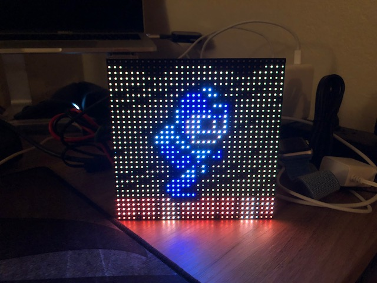
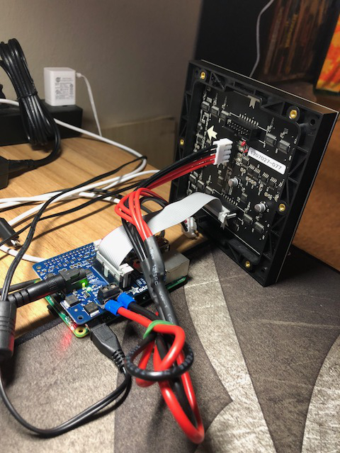

# 8-bit Pixel Art Display Project

I've always thought that RGB LED panels would be perfect for displaying old-school pixel art. So I decided to work on a little project intended to highlight some of my favorite Nintendo Entertainment System gaming memories via a montage of short animations using actual NES sprites and background tiles.



Several folks have asked me to provide a description of how I built the project, so I've shared the animation code in this repo as well as a detailed guide below on how I set it all up. As I add more pixel art, I will continue to update this repo. I intend to provide better code documentation in the future as well, but what's here will allow people to reproduce the project.

This is a labor of love that I'm putting together on my spare time. I'm a data scientist, not a software engineer, so you'll have to forgive any amateurish coding. I appreciate feedback, though I may not be able to address feature requests in a timely manner. The best place to reach me regarding this project is via message or DM on Twitter: [@DocBrownPhd](https://twitter.com/DocBrownPhD)

Note that all of the art included herein is intended as an homage to old-school gaming, and is freely shared with the community under the [Creative Commons Attribution 4.0 International (CC BY 4.0) License](https://creativecommons.org/licenses/by/4.0/) (basically do whatever you want with it as long as you let people know where you got it). All characters, art, and other trademarks are the properties of their respective owners.


## Required hardware components



I've listed the components used to build the display below. It may be possible to substitute some of the parts, such as using a Raspberry Pi 2 or a different display matrix, but I haven't tested this and can't offer any guidance on what changes may be required to the descriptions below. I've provided links to the [Adafruit](https://www.adafruit.com/) store or [Amazon](https://www.amazon.com/) for components as that's where I purchased them, though they're likely available elsewhere.

**Raspberry Pi**

- [Raspberry Pi 3 B](https://www.adafruit.com/product/3055)
- [Raspberry Pi Power Supply](https://www.adafruit.com/product/1995) 
- [microSD card](https://www.amazon.com/Sandisk-MicroSDHC-Memory-Adapter-Packaging/dp/B001FXZTIY/ref=sr_1_3?ie=UTF8&qid=1531624103&sr=8-3&keywords=4+gb+micro+sd+card&dpID=41N04fRwLWL&preST=_SY300_QL70_&dpSrc=srch) - You'll need ~2 GB, so a 4 GB card is plenty.
- [microSD card reader](https://www.amazon.com/IOGEAR-MicroSD-Reader-Writer-GFR204SD/dp/B0046TJG1U/ref=sr_1_9?ie=UTF8&qid=1531610754&sr=8-9&keywords=microSd+card+reader) - Some computers have these built in.

**32 x 32 LED RGB display matrix**

- [32 x 32 RGB LED Matrix Panel](https://www.adafruit.com/product/607) - Adafruit has a number of different available pixel sizes, I used the '4 mm pitch'.
- [5V 4A Switching Power Supply](https://www.adafruit.com/product/1466) - Both the Pi and the display should be independently powered.
- [Adafruit RGB Matrix HAT](https://learn.adafruit.com/adafruit-rgb-matrix-plus-real-time-clock-hat-for-raspberry-pi)
	- The RGB Matrix HAT makes wiring the RGB LED Matrix to the Raspberry Pi very straighforward; however, **it does require some light soldering**. I was able to do this by buying a [cheap soldering iron](https://www.adafruit.com/product/180), and [this solder](https://www.adafruit.com/product/1930). I also found [Getting Started with Soldering](https://www.adafruit.com/product/3715) by Marc De Vinck very helpful. 
- [CR1220 coin cell battery](https://www.amazon.com/Energizer-CR1220-Drain-lithuim-Battery/dp/B003CU3E2Q/ref=sr_1_3?ie=UTF8&qid=1532292025&sr=8-3&keywords=cr1220+battery) (for the RGB Matrix HAT)	

## Putting the hardware together

Adafruit has a [step-by-step guide](https://learn.adafruit.com/adafruit-rgb-matrix-plus-real-time-clock-hat-for-raspberry-pi/assembly) on how to assemble the The RGB Matrix HAT. This is followed by another [step-by-step guide](https://learn.adafruit.com/adafruit-rgb-matrix-plus-real-time-clock-hat-for-raspberry-pi/driving-matrices) on how to connect the Raspberry Pi to the display. However, the following guide assumes the we stop at the end of 'Step 3. Connect RGB Matrix Data cable to IDC' in the second guide. Setting up the Raspberry Pi and installing required software is handled below.

**Note:** The software that Adafruit provides enables additional functions and custom settings for the RGB Matrix HAT that I'm not using in this project. If this is of interest, you may want to read the details in Steps 4 and beyond.

## Setting up the software

Next, we need to install the OS onto the microSD card and download all of the drivers and libraries required to run the animations. I've assumed zero familiarity with the Raspberry Pi ecosystem, so I've tried to be explicit below. 

1. **Download [Raspbian](https://www.raspberrypi.org/downloads/raspbian/), the Raspberry Pi operating system** 

	A direct link to the latest stable 'lite' build can be found [here](https://downloads.raspberrypi.org/raspbian_lite_latest). For development purposes, the build that I used was `2018-06-27-raspbian-stretch-lite.img`.

2. **Put the image on a microSD card**
		
	This involves creating a bootable microSD card from the Raspbian image downloaded above. As an OS X user, my preferred method for doing this is using [ApplePi-Baker](https://www.tweaking4all.com/software/macosx-software/macosx-apple-pi-baker/). Follow the link to see instructions on its use (you'll select the microSD card from the menu, choose the IMG file in the 'Pi-Ingredients: IMG Recipe' box, and click on 'Restore Backup'). 
	
	I used version 1.9.4 of ApplePi-Baker, which can be downloaded directly [here](https://www.tweaking4all.com/?wpfb_dl=94).
	
	If Windows users have a simmilar easy-to-use bootable SD crad creator, please send me a message ([@DocBrownPhd](https://twitter.com/DocBrownPhD)) and I'll put it here. 

3. **Set up the Raspberry Pi**
	
	Make sure that neither the Raspberry Pi nor the RGB HAT is plugged in. Pop in the microSD card,  then make sure that the unit is connected via HDMI to a monitor and to a keyboard via USB. Plug the power cable into the 5V plug on the HAT as well as the smaller power cable into the Rasberry Pi and allow the unit to boot to the login. The default username is `pi` and the password is `raspberry`. This should get you to the linux command line.
		
	The first step is to run the following command, which will bring up the Raspberry Pi configuration menu:
	
	`sudo raspi-config`
	
	1. Unless you are in Great Britain at which point you can skip this step, via the arrow keys and enter, navigate to `4 Localisation Options` (as you change each option you'll be dropped back into the top-level menu, so navigate back to the sub-menu).

		Select `I1 Change Locale`, and choose your local via the spacebar, confirming with enter (for the US that would be `en_US.UTF-8 UTF-8`. Confirm that you want this as the default for the system environment.
		
		Select `I2 Change Timezone` and select your region then timezone.
		
		Select `I3 `. If you're in the US, you'll most likely want to pick `Generic 104-key PC` > `other` > `English (US)` > `English (US)` > `The default for the keyboard layout` > `No compose key`
		
	2. Navigate to `7 Advanced Options` and select `A2 Overscan` > `No` > `Ok`. (This makes the display fill the entire screen).

	3. Set up wi-fi by selecting `2 Network Options` > `N2 Wi-fi` and following the instructions. You'll also want to set up the Pi's SSH server so that you'll be able to log into the Raspberry Pi from another PC (such that the Pi doesn't have to be connected to a display or keyboard) by navigating to `5 Interfacing Options` and selecting `P2 SSH` > `Yes` > `Ok`.

	4. Navigate to `Finish` and the system should automatically reboot. Login as before.

4. **Install required software**

	Download all of the software required to run the animation montage by running the following commands, one at a time (note that some of these will take a while):

	```
	sudo apt-get install -y vim tmux git
	sudo git clone https://github.com/carloartieri/8bit_raspi_pixel_art_display.git
	sudo 8bit_raspi_pixel_art_display/install.sh
	```

5. **Run the animation script**

	If you'd like to run the animation script manually by logging into the Pi, you can do so by typing:

		sudo python3 8bit_raspi_pixel_art_display/run_montage.py


	By appending `-h` to the end of the above command, you can get a summary of the command line options available. In particular, if you'd like the individual animations to run longer, add `--cycles 1000` (or `2000`). Also, adding `--shuffle` shuffles the order of animation routines at startup. 
	
	If you'd like the montage to run in the background, such that you could ssh into the Raspberry Pi, turn it on and then log out, use the following command (adding desired options before the `&`):

		sudo nohup python3 8bit_raspi_pixel_art_display/run_montage.py &

	However, both of the options above will have to be rerun if the Pi is turned off. Alternatively, if you'd like the Pi to launch the animation code immediately upon boot-up, you'll have to edit the `/etc/rc.local` file (using a command such as `sudo vim /etc/rc.local`) to add the following command before the `exit 0` line:
	
		sudo /usr/bin/python3 /home/pi/8bit_raspi_pixel_art_display/run_montage.py --cycles 1000 --shuffle &
	
	Note that mistyping the above command can prevent the Raspberry Pi from booting, so type it in carefully! In this case, you can simply unplug the Pi to stop the display and plug it back in to restart.
	
## Updating

When I get around to adding new animation routines, I'll update the Changelog below. In order to get these changes without having to redo a fresh install, you'll simply need to 'pull' the updates from github and relaunch the animation script. Upon logging into the Pi, run the following commands:

```
cd 8bit_raspi_pixel_art_display
sudo git pull origin
cd ..
```	

Then run the animation routine as above.

## Credits, links, and resources

- Information about the default NES palette RGB values was obtained from: 
	
	[http://www.thealmightyguru.com/Games/Hacking/Wiki/index.php/NES_Palette](http://www.thealmightyguru.com/Games/Hacking/Wiki/index.php/NES_Palette)
	
- Sprite and animation information was obtained from:
	- [https://www.spriters-resource.com](https://www.spriters-resource.com)
	- [http://www.nesmaps.com](http://www.nesmaps.com)
	- FF DOT. The Pixel Art of FINAL FANTASY (2018). [Amazon link](https://www.amazon.com/DOT-Pixel-Art-FINAL-FANTASY/dp/4757555393/ref=sr_1_1?ie=UTF8&qid=1531626724&sr=8-1&keywords=ff+dot).

- The actual code that drives the display matrix is hzeller's rpi-rgb-led-matrix library, available at: [https://github.com/hzeller/rpi-rgb-led-matrix](https://github.com/hzeller/rpi-rgb-led-matrix)

- Finally, thanks to all of the NES developers and publishers featured herein for the memories!

## Changelog (last 3)

**2018.08.12**

- Added Metal Man and Crash Man sprites as well as Flash Man stage background to *Mega Man 2* animation routine.
- Added Blue Iron Knuckle sprite and Forest background to *Zelda 2* animation routine.
- Added Jason out of Sophia and Area 3 background to *Blaster Master* animation routine.

**2018.08.07**

- Added *Kirby's Adventure* animation routine.
- Added new sprites and backgrounds to *Super Mario Bros. 3* animation routine.
- Added new background to *Final Fantasy* animation routine.

**2018.07.31**

- Added new sprites and a new background to the *Dragon Warrior* animation routine.
- Added *AD&D Dragon Strike* and *Excitebike* animation routines. 
- Fixed minor typo bug in display sprite code.

See [complete Changelog here](changelog.md).